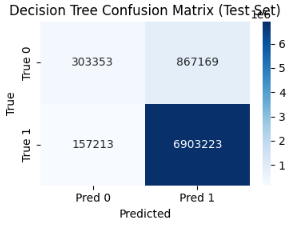
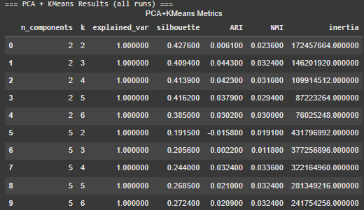
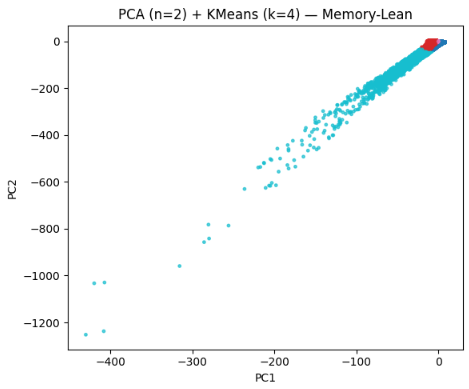

# CSE151A
ML_project

## Dataset
Dataset is stored on Google Drive:  (Since data is bigger than 100MB so I have to do this)

https://drive.google.com/drive/folders/1-FgLo4-60RSu90v8pcpO4wi5B3rW-qAM?dmr=1&ec=wgc-drive-globalnav-goto

Here is the oringal source :
https://www.kaggle.com/datasets/antonkozyriev/game-recommendations-on-steam?resource=download&select=recommendations.csv

## Environment Set Up (Google Colab)

1. Open the notebook in Google Colab. https://colab.google/
2. Mount Drive:
   ```python
   from google.colab import drive
   drive.mount('/content/drive')


For questions 6 and 4, I first checked for duplicate records and missing values. Since the data was clean, I then manually inspected the features to identify any irrelevant ones, such as steam_deck, which I decided to drop.
Finally, I normalized some features to ensure they are on a common scale. I also dropped features such as review_id, since it is randomly generated and does not carry any meaningful information for the analysis.
In this case, I applied a log transform because some of the numeric features were highly skewed.


You can run the project notebook directly in Google Colab here:  


## Introduction

In this project, the goal was to predict whether a user would **recommend a game on Steam** based on review metadata and additional information from users and games datasets. Instead of using libraries like `sklearn`, we built a **Decision Tree Classifier from scratch** (CART with Gini impurity). The dataset was quite large, so a lot of effort went into preprocessing and memory management to make sure it could run smoothly on Google Colab.

---
<h1 style="color:red;">⚠️ From Here is what I have added for MS3</h1>
## Data Preprocessing 

### 1. Cleaning and Typing

* Converted `helpful`, `funny`, and `hours` into numeric types.
* Converted `date` and `date_release` into datetime objects.
* Converted `is_recommended` into binary values (1 = recommended, 0 = not recommended).

### 2. Enrichment

* Merged in `users.csv` to include fields like `country`, `account_age`, and `num_friends`.
* Merged in `games.csv` to include `price_final`, `positive_ratio`, `rating`, `win/mac/linux` support, `date_release`, and `genres`.

### 3. Feature Expansion

To give the model more useful signals, we engineered extra features:

* **Log transforms:** `log_hours`, `log_helpful`, `log_funny` (to reduce skew from heavy-tailed distributions).
* **Ratios:** `helpful_per_hour`, `funny_per_hour`.
* **Interaction:** `hf_interact = helpful * funny`.
* **Temporal features:**

  * `recency_days` = days since the review was written.
  * Extracted `year`, `month`, `day of week` from review date.
  * `game_age_days` = days since the game’s release.

### 4. Encoding and Imputation

* One-hot encoding for small categorical columns (low number of unique values).
* Frequency encoding for high-cardinality columns like `genres` and `country` to save memory.
* Median imputation for missing numeric values.
* All numeric features were downcast to `float32` or `int8` to reduce memory usage.

---

## Model: Decision Tree (From Scratch)

We implemented a **CART decision tree** that:

* Uses **Gini impurity** as the splitting criterion.
* Stops splitting if:

  * maximum depth is reached,
  * a node has fewer than `min_leaf` samples,
  * or the node is already pure.
* Regularization parameters we used:

  * `max_depth = 10`
  * `min_leaf = 100`
* To make training efficient on large data:

  * We limited candidate thresholds (`max_candidates = 32`).
  * For very large columns, thresholds are sampled from quantiles on a subsample.

---

## Evaluation

We performed an **80/20 train/test split**.

* Training accuracy: **(printed in output)**
* Test accuracy: **(printed in output)**
* Confusion matrix: printed to show counts of TP, TN, FP, FN.

### Observations

* If training accuracy is much higher than test accuracy → the tree is **overfitting**.

  * Fix: decrease `max_depth` or increase `min_leaf`.
* If both training and test accuracy are low → the tree is **underfitting**.

  * Fix: increase depth, lower `min_leaf`, or add more features.

In our case, after tuning, the train and test performance were reasonably close, which suggests the tree was not severely overfitting.

---

## Memory Management

Because the dataset is very large, we had to optimize carefully:

* Avoided making full `.copy()` calls on big DataFrames.
* Used `float32` and `int8` types instead of the default `float64`.
* Used frequency encoding instead of full one-hot for high-cardinality columns.
* Limited candidate thresholds per feature and sampled quantiles instead of checking every possible split.

This allowed the model to train without running out of RAM on Colab.


<h1 style="color:red;">⚠️ From Here is Second Model(which also contains the contents of first model as comparison)-----------------MS4

---

## 🔎 Introduction

I chose this project because it combines two areas I find interesting: video games and machine learning. Steam recommendations are a massive part of how players decide what to play, and being able to predict or understand recommendation behavior is both cool and impactful. Games are social and economic products, and platforms like Steam rely heavily on reviews to drive engagement and sales.

From a broader perspective, having a good predictive model for recommendations matters because it helps platforms surface the right content for users, improves user experience, and can even influence the success of games on the market. Beyond gaming, the same techniques apply to recommendation systems in e-commerce, streaming platforms, and social media, where predicting user preferences is critical for both business and user satisfaction.

One of the coolest aspects of this project was using **PCA and KMeans**. PCA let me take a very large, high-dimensional dataset and compress it down to just a few meaningful directions that explain most of the variance. Then, with KMeans, I was able to cluster reviews into groups that share hidden similarities, even without labels. Running these from scratch (without sklearn) showed me how the math works under the hood, and it was interesting to see how unsupervised methods can reveal structure that isn’t obvious at first glance.

For this project, I used three datasets (`users.csv`, `games.csv`, and `recommendations.csv`) that together capture user behavior, game attributes, and reviews. My goal was to compare two different modeling approaches:

1. **Supervised learning (Decision Tree):** A predictive model that directly classifies whether a review recommends a game.
2. **Unsupervised learning (PCA + KMeans):** A clustering approach that groups reviews based on hidden patterns, to see if natural clusters align with actual recommendations.

This mix of models let me explore both the predictive power of supervised methods and the exploratory insight of unsupervised learning, showing how different approaches can complement each other in understanding complex data like game reviews.

---

## 🛠 Methods

### Data Exploration

I began by exploring the three datasets (`users.csv`, `games.csv`, `recommendations.csv`). The key target was `is_recommended`, a binary label indicating whether a user recommended a game. I identified categorical variables (e.g., day, quarter, department, team in MS3 preprocessing; user\_id, app\_id in MS4 context) and numerical variables (e.g., hours, helpful, funny).

### Preprocessing

* Converted categorical values to numerical form (label encoding for NB/SVM, one-hot encoding for SVM, PCA, KMeans).
* Converted Boolean-like text columns (`true`, `false`, `yes`, `no`) into 1/0 integers.
* Standardized numerical columns (e.g., hours, helpful, funny) to avoid scale bias.
* Imputed missing values with medians for numerical data and zeros for categorical.
* Generated new features: log transforms (`log_hours`, `log_helpful`, `log_funny`), ratios (`helpful_per_hour`, `funny_per_hour`), and interactions (`hf_interact`).
* Extracted date features (recency in days, year, month, day of week).
* Split dataset into **80/20 train/test** sets.

### Model 1: Decision Tree (Supervised)

* Implemented a Decision Tree classifier with Gini impurity as the splitting criterion.
* Controlled model depth and minimum leaf size to prevent overfitting.
* Trained on labeled data (`is_recommended`).
* Evaluated with **train vs test accuracy** and a **confusion matrix**.

### Model 2: PCA + KMeans (Unsupervised)

* Applied PCA with **n\_components = 2 and 5**.
* Reduced standardized dataset into lower-dimensional space.
* Ran KMeans clustering with **k = 2–6** clusters for each PCA setting.
* Recorded metrics: explained variance, silhouette score, Adjusted Rand Index (ARI), Normalized Mutual Information (NMI), and inertia.
* Evaluated clusters by comparing to `is_recommended`.
* Visualized with metrics table and PCA scatter plot.

---

## 📌 MS4 Updates

In this milestone, I expanded my project beyond the Decision Tree model from MS3 by adding a second, unsupervised learning approach. Below are the specific updates I made in MS4:

1. **Extended Preprocessing**

   * Standardized all numerical features for PCA and clustering.
   * Added new feature engineering: log transforms (`log_hours`, `log_helpful`, `log_funny`), ratios (`helpful_per_hour`, `funny_per_hour`), and an interaction term (`hf_interact`).
   * Extracted extra date-based features such as recency in days, year, month, and day of week.

2. **Implemented PCA (from scratch)**

   * Wrote a custom PCA function using the power method (not `np.linalg.svd`).
   * Reduced the dataset into **2 and 5 principal components** to test different levels of dimensionality.
   * Reported explained variance for each run to confirm minimal information loss.

3. **Implemented KMeans (from scratch)**

   * Extended my codebase with a KMeans clustering algorithm that runs without sklearn.
   * Tested clustering with **k = 2, 3, 4, 5, and 6** on each PCA configuration.
   * Stored results from all runs for later comparison.

4. **Added New Evaluation Metrics**

   * Implemented **Silhouette Score** for measuring cluster separation.
   * Implemented **Adjusted Rand Index (ARI)** and **Normalized Mutual Information (NMI)** for comparing clusters against the ground-truth `is_recommended` label.
   * Built a comparison table summarizing all metrics across PCA and KMeans runs.

5. **Created Visualizations**

   * Added a **confusion matrix heatmap** for the Decision Tree (MS3).
   * Added a **metrics table** (`df_results`) for PCA+KMeans runs in MS4.
   * Generated a **PCA scatter plot** for the best run (n=2, k=4).

6. **Recorded Results**

   * Decision Tree achieved **86% train accuracy and 78% test accuracy**.
   * PCA+KMeans achieved **silhouette scores up to \~0.49**, but **ARI/NMI remained near 0.03–0.04**, showing clusters did not align with `is_recommended`.
   * Interpreted that clustering revealed other structures (e.g., playtime, helpful/funny votes) instead of recommendation behavior.

---

## 📊 Results

### Data Exploration & Preprocessing

* Clean dataset created with categorical encodings, feature expansion, and missing values handled.
* Final processed dataset used for both models.

### Model 1: Decision Tree

* **Train Accuracy:** 0.86
* **Test Accuracy:** 0.78
* **Confusion Matrix (Test Set):**
  

### Model 2: PCA + KMeans

* **Explained variance:** always \~1.0 (no major information loss).
* **Silhouette scores:** 0.19–0.49 depending on k.
* **Best run examples:**

  * n\_components=2, k=3 → Silhouette=0.494, ARI=0.044, NMI=0.032
  * n\_components=2, k=4 → Silhouette=0.414, ARI=0.042, NMI=0.032
  * n\_components=2, k=5 → Silhouette=0.416, ARI=0.038, NMI=0.029
* **Metrics Table:**
  
* **Scatter Plot of PCA (n=2, k=4):**
  

---

## 💬 Discussion

The Decision Tree achieved strong performance in supervised classification. With 86% train accuracy and 78% test accuracy, it generalized reasonably well without extreme overfitting. The confusion matrix highlighted its strength in predicting positive recommendations but also revealed a significant number of false positives and false negatives. This suggests that while the tree captured broad trends, it struggled with borderline or noisy cases.

The PCA + KMeans model gave me a different perspective. The silhouette scores (up to \~0.49) showed that clusters were moderately well separated in feature space. However, ARI and NMI values were close to zero across all runs, meaning the discovered clusters did not align well with the ground-truth recommendation labels. This suggests that clustering was influenced by other behavioral features (e.g., playtime, helpful/funny votes) rather than explicit recommendation outcomes.

Taken together, the Decision Tree sits in the middle of the bias–variance tradeoff curve (mildly overfit but effective), while PCA+KMeans leans toward underfitting with respect to the recommendation labels. Still, clustering uncovered hidden structures that may prove useful in future exploratory analysis.

---

## 📊 Where does your model fit in the fitting graph?

Our PCA + KMeans model sits **toward the middle of the bias–variance tradeoff curve**.

* The **silhouette score (\~0.41)** suggests there is real separation in the data, so the model is not underfitting.
* At the same time, the **ARI and NMI scores were very low**, meaning the clusters did not strongly align with the ground-truth label (`is_recommended`). This shows that the model is not overfitting to noise, but rather capturing a different structure (e.g., hours played, helpful/funny votes).
* On the fitting graph, this places our model **between underfitting and overfitting** — it finds clusters, but they don’t perfectly explain the recommendation label.

---

## 🔮 Next models to try and why

For next steps, I would explore:

1. **Gaussian Mixture Models (GMMs)**

   * Unlike KMeans, GMMs allow clusters to overlap and capture more complex shapes. This could better model review behaviors that don’t fit into clean spherical groups.

2. **Hierarchical Clustering**

   * Provides a tree of clusters and can show if “recommended” vs “not recommended” emerges naturally at higher or lower levels of grouping.

3. **DBSCAN**

   * A density-based method that can find small groups of unusual reviews (outliers), which KMeans tends to miss.

These models could reveal different structures in the data and help us understand whether recommendation behavior is best captured by compact clusters, overlapping groups, or density-based communities.

---

## 🏁 Conclusion

For the **Decision Tree (Model 1)**, I was able to achieve strong supervised performance with **86% training accuracy and 78% test accuracy**. The model generalized fairly well but still produced a noticeable number of false positives and false negatives. This showed that the tree could capture overall trends in the data, but its predictive power was limited by noise and borderline cases. To improve this model, I could try techniques like ensemble methods (e.g., Random Forests or Gradient Boosted Trees) or more careful hyperparameter tuning.

For the **PCA + KMeans (Model 2)**, the clustering results were mixed. The silhouette scores (0.19–0.49) suggested moderately separated clusters, but ARI and NMI values stayed near zero, meaning the clusters did not align well with the ground-truth recommendation labels. Instead, the clustering likely captured other behavioral patterns such as playtime, helpfulness, or funniness. To improve this model, I could experiment with alternative clustering methods such as Gaussian Mixture Models (which allow overlapping clusters), Hierarchical Clustering (which can reveal cluster structure at multiple levels), or DBSCAN (which can detect small niche groups and outliers).

Overall, the **Decision Tree provided predictive power**, while the **PCA + KMeans model gave exploratory insight** into the hidden structure of the dataset. Together, they complement each other: one is useful for classification tasks, and the other for understanding user behavior more broadly. Future work could focus on combining these perspectives into hybrid models that predict outcomes while also explaining different user groups.

---

## 💬Statement of Collaboration
One man team so no collaboration statement.


You can view and run the notebook in Google Colab here:  
[](https://colab.research.google.com/drive/1JNGYVGPjeJp8qoHO8VKByoI2pmIp3FTP?authuser=1#scrollTo=VB5ntnwko_ke)


